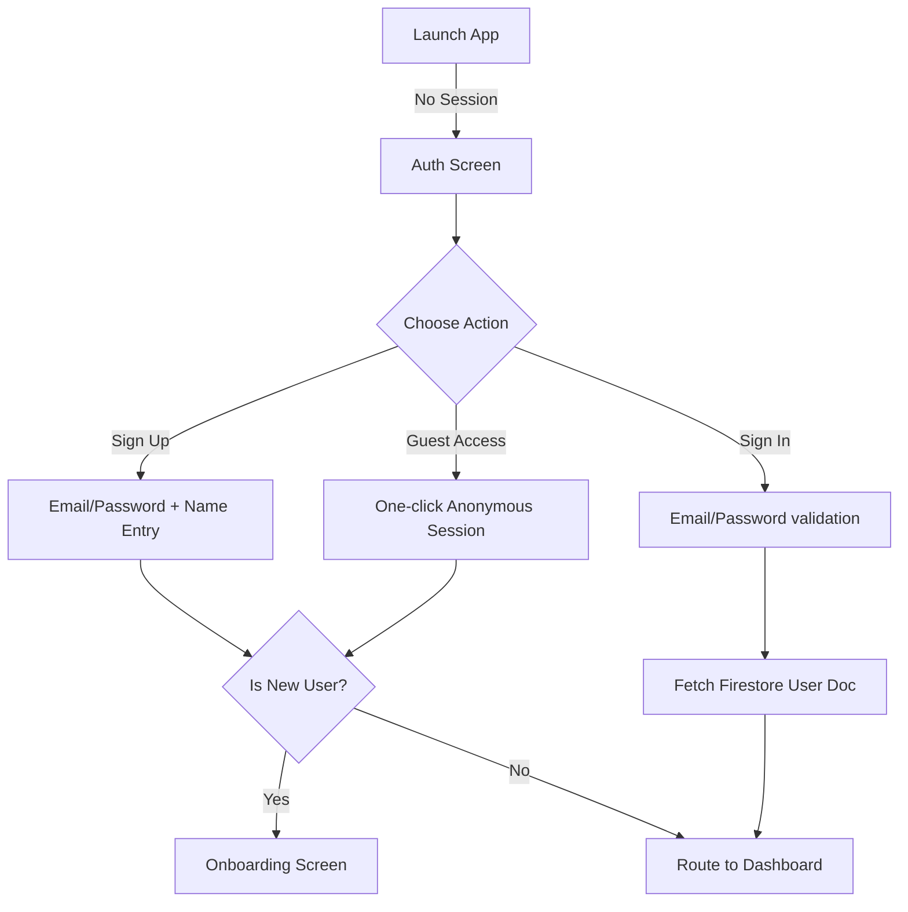
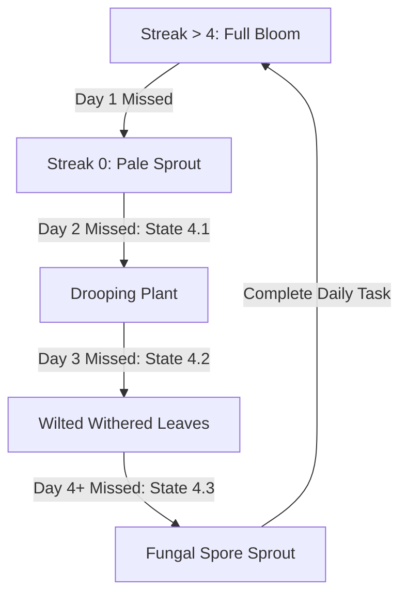

# ZenStudy Design Document

This document defines the user interface, database schemas, signup/login workflows, interaction states, visual layout, and operational state flows for every segment of the **ZenStudy** application.

---

## 1. Visual Design System & Theme (Student-Centric & Premium)

To make the app highly engaging and fun for students, we draw visual inspiration from award-winning interfaces like **Duolingo** (playful gamified micro-feedback and streak counts), **Forest** (calming, progress-based nature widgets), and **Linear** (slick, high-performance dark glassmorphism).

### CSS Theme Tokens (Custom Properties)
```css
:root {
  /* Colors */
  --bg-deep: hsl(224, 32%, 8%);        /* Slate black */
  --bg-card: hsla(224, 30%, 14%, 0.6); /* Translucent slaty glass */
  --border-glass: rgba(255, 255, 255, 0.08);
  --border-glow: rgba(139, 92, 246, 0.15);
  
  /* Mood Accents */
  --accent-violet: hsl(263, 90%, 66%);  /* Primary Brand / Reflection */
  --accent-teal: hsl(162, 76%, 41%);    /* Success / Growth / Calm */
  --accent-rose: hsl(342, 75%, 62%);    /* Warmth / Insecurity reframing */
  --accent-orange: hsl(24, 94%, 50%);   /* Energy / High stress alert */
  
  /* Text */
  --text-main: hsl(210, 40%, 98%);
  --text-muted: hsl(215, 20%, 65%);
  
  /* Fonts & Blur */
  --font-display: 'Outfit', sans-serif;
  --font-body: 'Inter', sans-serif;
  --glass-blur: blur(14px);
}
```

### Aesthetic Guidelines:
*   **Tactile Buttons**: Buttons shift downward by `2px` on active click with a scaling bounce, mimicking game pads.
*   **Frosted Edges**: Card borders use gradient boundaries: `linear-gradient(135deg, rgba(255,255,255,0.1), rgba(255,255,255,0.02))`.
*   **Vibrant Mood Gradients**: Visual highlights pulse slowly (`animation: pulse 8s infinite`) to create a calm, living breathing canvas.

---

## 2. Authentication & Onboarding Workflows

### 2.1. Authentication Portal (Login / Signup)
Upon loading, if the client detects no active session, it redirects to the Auth Screen containing a centered, frosted glass login container.



*   **Design**: Glowing neon input fields. The container shifts borders from purple (signup) to teal (login) dynamically.
*   **Firebase Integration**:
    *   `createUserWithEmailAndPassword` or `signInWithEmailAndPassword` for account access.
    *   `signInAnonymously` for guest access, creating a temporary profile in Firestore to ensure immediate entry.

---

## 2.2. Onboarding Workflow (The Zen Gate)
New profiles must configure their study parameters:
1.  **Name & Target Exam Selection** (e.g., JEE, NEET, UPSC, Boards).
2.  **Exam Target Date** (used by Shanti to track countdown pressures).
3.  **Choose Starting Plant Seed** (represented as interactive, pulsating vector SVGs: Cactus, Bonsai, Fern).
4.  *Trigger: Creating Firestore User Document* unlocks the main app workspace.

---

## 3. Database Architecture: Cloud Firestore

We will use **Cloud Firestore** as our primary database for persistence, configured with a local fallback engine (`localStorage`) if remote database settings are not initialized.

### Firestore Collections & Documents

#### 3.1. `users` Collection
Tracks the student profile, streak stats, garden progress, and redeemed items index.
```json
// Document: users/{userId}
{
  "name": "Aarav",
  "targetExam": "JEE",
  "targetDate": "2026-07-28T00:00:00.000Z",
  "startingPlant": "bonsai",
  "streak": 5,
  "zenPoints": 120,
  "lastActive": "2026-06-13T07:00:00.000Z",
  "createdAt": "2026-06-08T12:00:00.000Z",
  "redeemedItems": ["lofi_beats_01", "streak_freeze_token"]
}
```

#### 3.2. `journals` Collection
Stores daily check-ins, rants, insecurities, and AI feedback cards.
```json
// Document: journals/{journalId}
{
  "userId": "Aarav_local",
  "timestamp": "2026-06-13T07:05:00.000Z",
  "moodScore": 4,
  "sentiment": "Anxious & Overwhelmed",
  "entryType": "rant", // general, rant, insecurity, burn
  "content": "The physics mock test today was extremely difficult. I couldn't solve electrostatics questions.",
  "stressTriggers": ["Mock Test Results", "Physics"],
  "copingStrategy": "Take a 5-minute break. Try the 4-7-8 breathing technique.",
  "encouragement": "A single mock test score doesn't define your JEE preparation. Focus on correcting mistakes."
}
```

---

## 4. Segment Workflows & High-Fidelity UI

### 4.1. Mind Garden & Streak Degradation States
The student's mental garden grows with healthy streaks, but decays step-by-step with neglect (days missed):



*   **Plant Decay States (SVG Design)**:
    *   **State 1-3 (Growth Phase)**: Green leaves sprout, stems grow tall, flowers bloom.
    *   **State 4.1 (Slight Spoil)**: Leaves rotate downward (drooping); color changes to pale green-yellow.
    *   **State 4.2 (Damaged / Wilted)**: Leaves turn brown and curl; black spots appear on the plant stem.
    *   **State 4.3 (Fungal Sprout)**: Small white/grey fungal spore dots grow on the pot and plant; a translucent grey mist overlay covers the garden panel.
*   **Recovery Action**: Completing any dashboard task (e.g., venting or breathing) instantly cures the plant and sets it back to the healthy growth phase based on their current streak.

---

### 4.2. Highly Creative Vent Rooms (The Sanctuary)
A tab-switched space with strong visual styling and micro-interactions:

#### A. Rant Room (Theme: *Neon Matrix Terminal*)
*   **Visuals**: Deep black backing, terminal font, glowing green characters.
*   **Interaction**: As the student types quickly, character inputs spawn tiny visual spark particles on the screen.
*   **Submit Flow**: Text collapses downwards like matrix code falling and disappears. Generates an immediate AI coping tip.

#### B. Insecurity Circle (Theme: *Celestial Constellation*)
*   **Visuals**: Midnight blue space background with faint glowing nebulas.
*   **Interaction**: Typing an insecurity floats it up as a dim, isolated star.
*   **Submit Flow**: The star shoots lines outward to connect with 10 other glowing stars, representing other students: *"Your star is connected. 14 other peers shared this insecurity today. You are not alone."*

#### C. Gossip Corner (Theme: *Retro Cafe Blackboard*)
*   **Visuals**: Dark wood textures, neon coffee sign, animated steam curls.
*   **Interaction**: Sticky posts look like handwritten chalk notes pinned with coffee-cup magnets. Users upvote by clicking a steaming cup button.

#### D. The Burn Chamber (Theme: *Volcanic Hearth*)
*   **Visuals**: Dark charcoal backdrop with a pulsing molten lava hearth at the bottom.
*   **Interaction**: Type worries into a slate-colored box.
*   **Submit Flow**: Clicking "Incinerate" drops the text card into the lava, triggering a flame burst animation. Text turns to orange sparks and floats up as embers.

---

### 4.3. Interactive Assessment Quests (Zen Oracle)
To encourage participation, assessments are presented as **lucrative quests** prompted by the wellness engine.

*   **Zen Oracle Recommendation Card**:
    *   Flashing at the top of the dashboard: *"The Zen Oracle detects focus fatigue. Clear the 'Physics Jitters' Quest for a 2.5x Multiplier (+25 ZP)!"*
*   **Assessments Flow**:
    *   **Visual Projective Swiper**: Swipe serene vector cards (e.g., stormy bridge vs mountain peak) to select a card matching their head-space.
    *   **Branching Scenario Dilemmas**: Comic-strip style cards with 4 choices. Answering correctly guides them out of negative cognitive biases.

---

### 4.4. The Zen Bazaar (Redeemable Reward Store)
A tab-accessible storefront allowing students to spend their hard-earned Zen Points ($ZP$).

```
+-------------------------------------------------------+
|  THE ZEN BAZAAR                      [ Balance: 120 ZP ]|
+-------------------------------------------------------+
|  [Focus Audio]   [Study Planners]   [Garden Upgrades] |
|  +-------------------+  +--------------------------+  |
|  | 🎧 Midnight Lofi  |  | ❄️ Streak Freeze Token   |  |
|  | Calm Focus Beat   |  | Save streak for 1 day    |  |
|  | Cost: 50 ZP       |  | Cost: 100 ZP             |  |
|  | [ REDEEM ]        |  | [ REDEEM ]               |  |
|  +-------------------+  +--------------------------+  |
+-------------------------------------------------------+
```

*   **Reward Items Configuration**:
    1.  **Midnight Lofi Beats / Brown Noise (50 ZP)**: Unlocks focus sound generators built right into the app's player drawer.
    2.  **Aesthetic Study Planner PDF / Notion Template (75 ZP)**: Provides a quick link copy button on unlock.
    3.  **Streak Freeze Token (100 ZP)**: Placed in user's profile database array; automatically consumes to protect their plant from decay if they miss a daily check-in.
    4.  **Golden Pot skin / Floating Garden Lantern (150 ZP)**: Unlocks SVG design options rendered on the Mind Garden canvas.
*   **Redeem Interaction State Machine**:
    *   *Sufficient ZP*: Button shows active teal border. Clicking triggers a golden coin particle explosion, plays a chime, deducts ZP, and renders a "✓ Unlocked / Use Item" button.
    *   *Insufficient ZP*: Button displays grey slate borders: *"Needs [Cost - ZP] more ZP"*.

---

### 4.5. Zen League (Leaderboard)
*   Glassmorphic table showcasing streaks and Zen Points of virtual cohort peers.
*   "Send Chai" interaction: Animates a hot tea cup sliding to a peer's profile, awarding points and showing a toast notification.

---

### 4.6. Context-Aware AI Companion ("Shanti")
*   Floating circular button in the bottom right opens a messaging drawer.
*   Shanti reads: Name, target exam, exam date, active mood indicators, and extracts summary tags from the Rant Room or Insecurity Circle database log to formulate empathetic responses.

---

## 5. UI Verification via Agent-Browser CLI

To run tests on our interface layout, responsiveness, and state machines, we will utilize the `chrome-devtools` browser automation agent tools:

1.  **Launch & Navigation**:
    *   Start local dev server: `npm run dev` (running at `http://localhost:5173`).
    *   Call `new_page` or `navigate_page` to go to `http://localhost:5173`.
2.  **Layout Verification**:
    *   Call `take_snapshot` to extract the semantic accessibility tree structure of the Onboarding form.
    *   Identify interactive buttons and sliders using their unique `uid` codes.
3.  **Visual Render Verification**:
    *   Call `take_screenshot` (saving to `/Users/aquibvadsaria/project/playground/Mental-Wellness-Tracker/verification/`) to inspect:
        *   Glassmorphic blurs and border highlights on different viewport widths.
        *   The rendering of the SVG plant model.
        *   The fire sparks animation in the Burn room.
