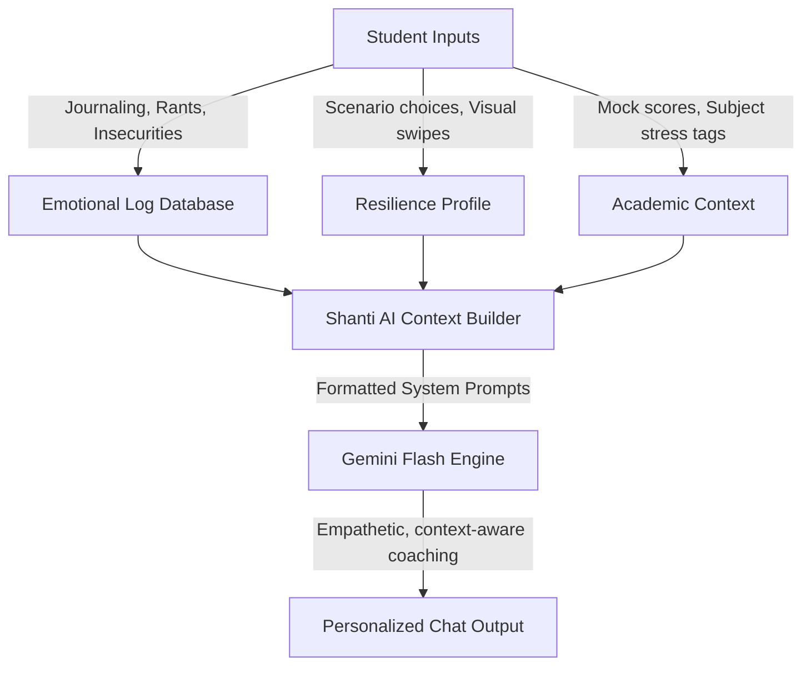

# REQUIREMENTS: ZenStudy Mental Wellness Tracker

This document contains the official product requirements and specifications for **ZenStudy**, a gamified, peer-collaborative, AI-driven mental wellness application designed specifically for competitive exam aspirants (e.g., JEE, NEET, UPSC, GATE, Boards).

---

## 1. Core Objectives

*   **Frictionless Assessment:** Uncover stress triggers and burnout levels using visual games, scenario questions, and structured journals instead of clinical questionnaires.
*   **Targeted Outlets:** Provide specific, themed release rooms (Rant, Insecurity, Gossip, Burn) to make journaling engaging and highly focused.
*   **Healthy Gamification:** Incentivize mental self-care and consistency using "Zen Points" ($ZP$), consistency streaks, and the "Zen League" leaderboard (wellness-focused, not academic scores).
*   **Contextual AI Companionship:** Provide a conversational AI ("Shanti") that remembers the student's history, exam timelines, mock test trends, and past journal content to deliver hyper-personalized coaching.

---

## 2. Competitive Positioning

| Feature | Competitor Gaps (Wysa, Forest, Daylio) | ZenStudy Solution |
| :--- | :--- | :--- |
| **Exam Context** | Standard apps are generic. | Tailored coping strategies aligned with exam schedules and mock test events. |
| **Engagement** | Journaling feels like a clinical chore. | Visual projection tests, branching scenario dilemmas, and themed journal rooms. |
| **Community** | Isolating study hours. | "Zen League" consistency leaderboards, "Silent Library" co-presence, and "Message in a Bottle" peer comfort. |
| **AI Personalization** | Stateless or general advice. | "Shanti" references past journals, test scores, and mood patterns. |

---

## 3. Targeted Journaling Rooms (Themed Release)

Instead of open-ended boxes, students choose specific rooms based on their immediate emotional state:

### A. Rant Room ("Vent Space")
*   **Purpose:** Release immediate frustration or anger (e.g., *"My teacher gave a terrible mock explanation"* or *"Organic chemistry makes no sense"*).
*   **Interaction:** A dark-themed, free-form text window. As the user typing reaches a fast tempo, text glow effects increase.
*   **Reward:** Earns $10\text{ ZP}$ upon submission. The entry is deleted or stored in a secure log, and AI immediately generates a funny/comforting cooldown phrase.

### B. Insecurity Circle ("Vulnerability Room")
*   **Purpose:** Share deep, isolating anxieties (e.g., *"What if I fail and my parents' money is wasted?"* or *"I feel slower than everyone in class"*).
*   **Interaction:** A calm, soft-glowing textbox. On submission, the app highlights: *"X other students preparing for your exam typed similar feelings today. You are not alone."*
*   **AI Integration:** AI companion reframes the insecurity using Cognitive Behavioral Therapy (CBT) techniques.

### C. Gossip Corner ("Light Banter")
*   **Purpose:** Social release and casual shared complaints.
*   **Interaction:** A bulletin-board style interface displaying random/targeted prompts based on exam prep milestones (e.g., *"Who else survived chapter 4 of Physics today?"* or *"Top coffee brands for 3 AM study blocks"*).
*   **Dynamic Triggers:** The Wellness Engine triggers Gossip cards when user analytics indicate elevated burnout.

### D. The Burn Chamber (Catharsis Room)
*   **Purpose:** Releasing negative self-talk, bad test grades, or toxic thoughts.
*   **Interaction:** The student types down their negative thought, hits "Burn", and watches the text dissolve into a flame animation. No history is kept of burnt items.

---

## 4. Playful State of Mind Assessment

To capture the student's current mood, the app uses interactive visual tasks:

### A. Visual Projective Card Swipe (TAT-Inspired)
*   Based on the **Thematic Apperception Test**.
*   The student is shown 3 ambient visual paintings (e.g., *Dimly lit desk*, *Winding path in a storm*, *Serene peak under starlight*).
*   The student swipes/selects the image representing their head-space and picks 1 descriptor word.
*   The selection maps directly to stress indicators (e.g., Desk = isolation; Storm path = lack of direction/extreme stress; Peak = resilience/calm).

### B. Scenario Dilemmas (CBT-Inspired)
*   Present daily branching choices (e.g., *"You got a low mock test mark. Do you: A. Tear the sheet, B. Study all night, C. Analyze errors, D. Log off and talk to Shanti?"*).
*   Dilemma selections map to behavioral profiles (burnout risk, active coping, catastrophizing).

---

## 5. Gamification, Zen League & Rewards

### A. Zen Points ($ZP$)
*   Visual check-in completion: $+10\text{ ZP}$
*   Scenario game: $+15\text{ ZP}$
*   Rant/Insecurity entry: $+15\text{ ZP}$
*   1-minute Breathing/Mindfulness: $+10\text{ ZP}$

### B. The Zen League
*   Students are placed in cohorts of 50 preparing for similar exams.
*   Rankings are based strictly on **consistency streaks** (days logged) and **wellness points** (completing self-care tasks).
*   **No academic marks are displayed on the public league board.** Only Zen streaks and custom badges.

### C. Redeemable Store
*   **Study Assets:** Printable aesthetic study planners, formula sheet templates.
*   **Focus Audio:** Lo-fi beats, brown noise, forest sounds.
*   **Streak Freeze:** Save your streak if you miss a check-in due to a major mock test day.
*   **Garden Upgrades:** Unique plants or decor for your virtual SVG Mind Garden.

---

## 6. GenAI Assistant ("Shanti") Context Architecture

The digital companion must maintain stateful context memory to behave as an authentic friend:

### Context variables injected into Shanti's prompt:
1.  **Identity:** Name, target exam, exam date.
2.  **Recent Mood State:** Last 3 mood ratings, selected projective images.
3.  **Active Stressor:** Subject/Trigger tags selected (e.g., "Maths Anxiety", "Mock Test drop").
4.  **Past Journal Highlights:** Short summaries of recent rants or insecurities (e.g., "User was stressed about score dip in chemistry yesterday").
5.  **Streak/Zen Progress:** "Encourage them on their 5-day consistency streak."

---

## 7. Psychological Foundation & Ethics

*   **Positive Reinforcement:** We celebrate self-care and resilience, not academic rankings.
*   **Coping Reframing:** Automatically intercept self-defeating language and offer alternative cognitive frameworks.
*   **Safety Net:** Safe conversational parameters. Shanti will flag trigger keywords (self-harm, depression indicators) and immediately trigger a static modal containing professional helpline links.

---

## 8. Development Roadmap

*   **Sprint 1:** Core framework setup (React, Glassmorphic UI Design System).
*   **Sprint 2:** Themed journal rooms (Rant, Insecurity, Burn) & Mock Test drawer.
*   **Sprint 3:** Interactive Visual Projective swiper & Scenario Dilemma framework.
*   **Sprint 4:** SVG Mind Garden & Zen League leaderboard interface.
*   **Sprint 5:** Shanti Chatbot integration with context memory.
